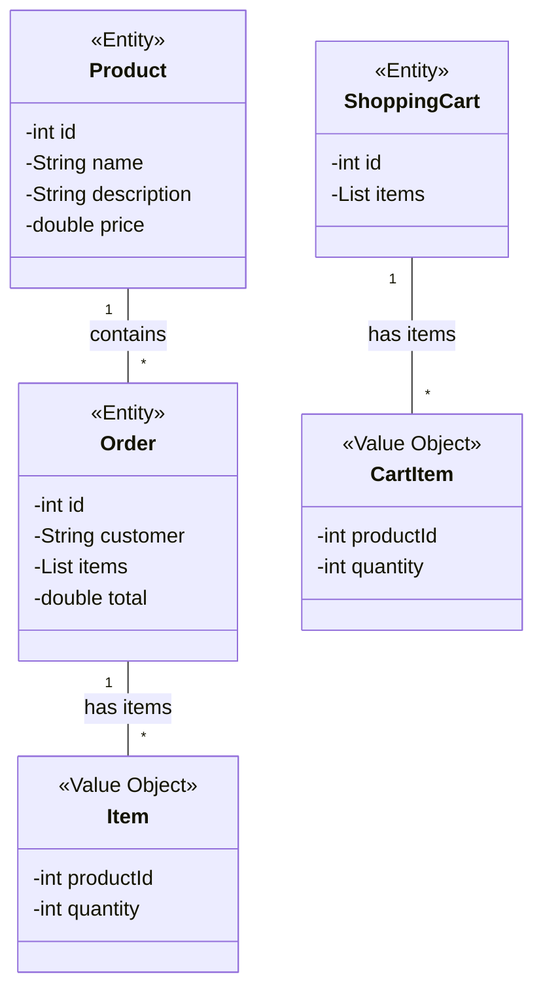

#Commerce API - Spring Boot

```mermaid
classDiagram
class Product {
<<Entity>>
-int id
-String name
-String description
-double price
}

class Order {
<<Entity>>
-int id
-String customer
-List<Item> items
-double total
}

class Item {
<<Value Object>>
-int productId
-int quantity
}

class ShoppingCart {
<<Entity>>
-int id
-List<CartItem> items
}

class CartItem {
<<Value Object>>
-int productId
-int quantity
}

Product "1" -- "*" Order : contains
Order "1" -- "*" Item : has items
ShoppingCart "1" -- "*" CartItem : has items
```
